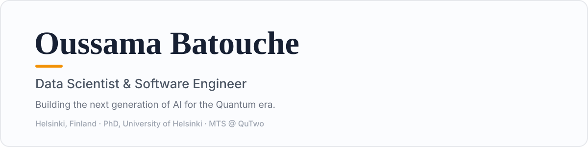

  
  
  
  

  
  
  

### 🧠 About Me

I'm a data scientist and software engineer based in Helsinki, working at the intersection of **artificial intelligence, healthcare, and quantum computing**.

- 🚀 Currently a **Member of Technical Staff at [QuTwo](https://oussamabatouche.com)**, working on next-generation AI for the quantum era.
- 🎓 I hold a **PhD from the University of Helsinki**, where my research applied AI, machine learning, and clinical data analysis to improve **prostate cancer care**.
- 🔬 Previously a **Data Scientist at HUCC** (Helsinki University Central Hospital), building computational tools for digital pathology and real-world clinical data.
- 🧬 I care about turning messy, real-world medical data into models that clinicians can actually trust.

### 🛠️ Tech &amp; Focus Areas

**What I work on**

I've trained deep learning models on the **LUMI supercomputer** and build end-to-end pipelines — from raw microscopy images to production-ready classifiers.

### 🔬 Selected Research

My work focuses on computational pathology and clinical outcome modeling for prostate cancer:

- **HistoEncoder** — a digital pathology foundation model for prostate cancer · *arXiv, 2024*
- **Prognostic impact of prostate cancer grade inflation in targeted biopsies** · *European Urology, 2023*
- **Computational pathology-based classifier for predicting Gleason grade group upgrading** · *Journal of Clinical Oncology (ASCO)*
- **A joint frailty model for time-to-treatment and biochemical recurrence in prostate cancer** · *Informatics in Medicine Unlocked, 2025*

📖 Full publication list on my [website](https://oussamabatouche.com) and [ORCID](https://orcid.org/0000-0003-4181-9891).

### 📌 Featured Projects

<table>
<tr>
<td width="33%" valign="top" align="center">
<h4>🧬 HistoEncoder</h4>
Foundation model for prostate cancer digital pathology
  

</td>
<td width="33%" valign="top" align="center">
<h4>🍋 Lemonade</h4>
Contributor to AMD's SDK for local LLM serving and inference
  

</td>
<td width="33%" valign="top" align="center">
<h4>🩺 PCC</h4>
AI assistant supporting clinical decision-making
  

</td>
</tr>
</table>

### 📈 GitHub Stats

 

### 📫 Get in Touch

  

<i>💻 code to be excited</i>

