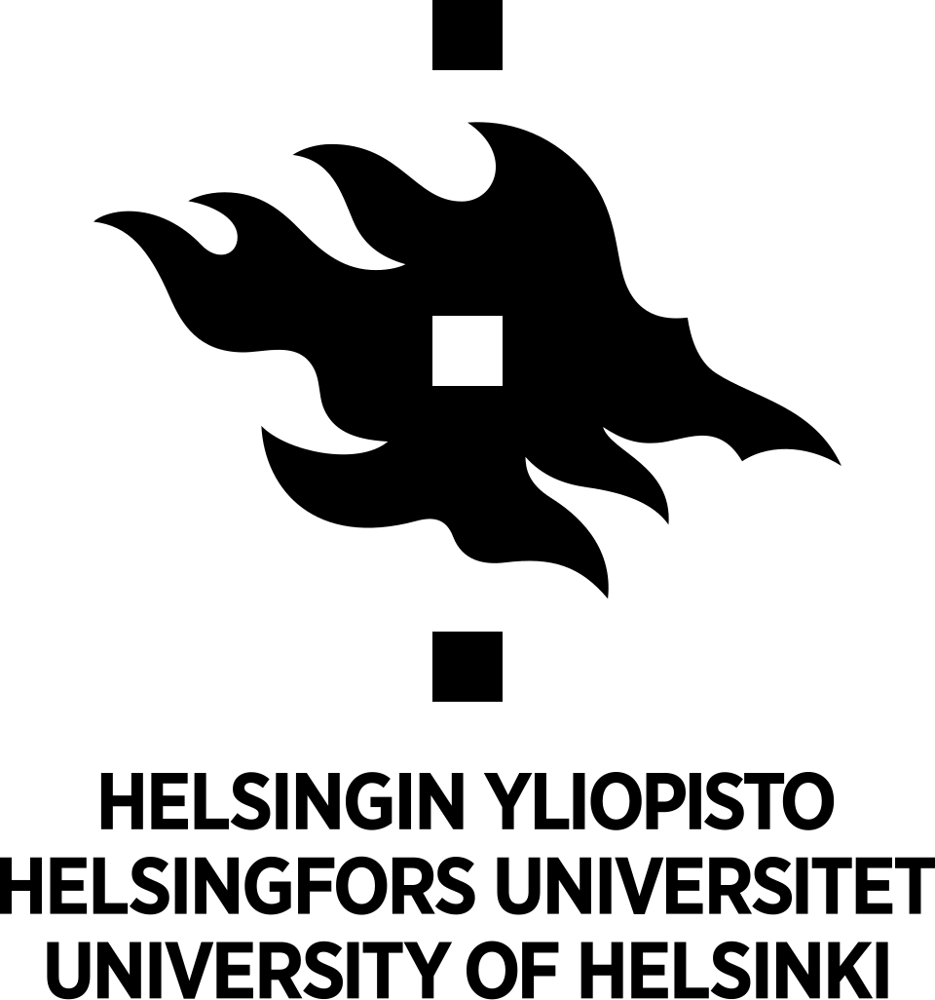
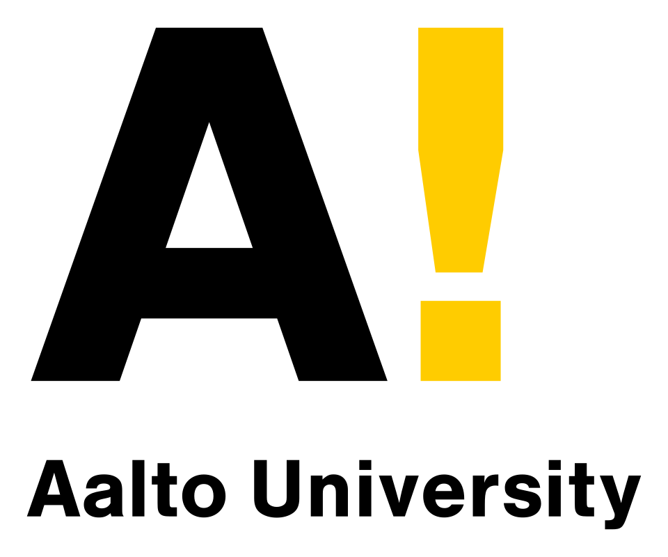
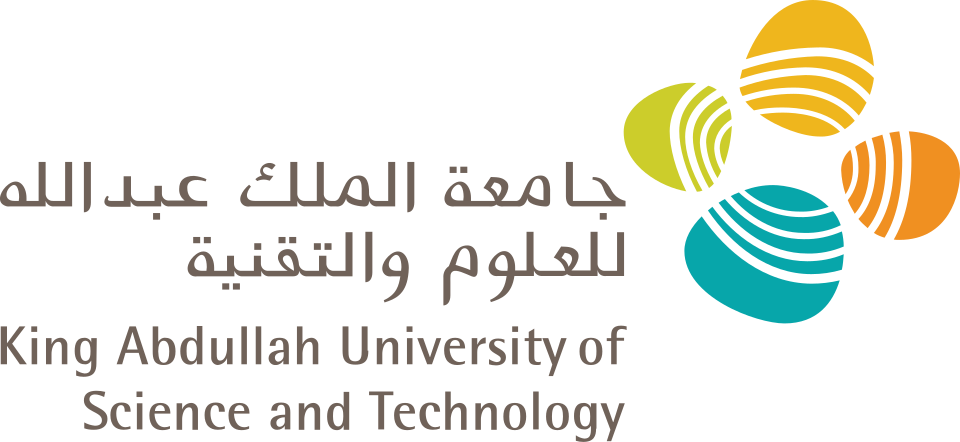
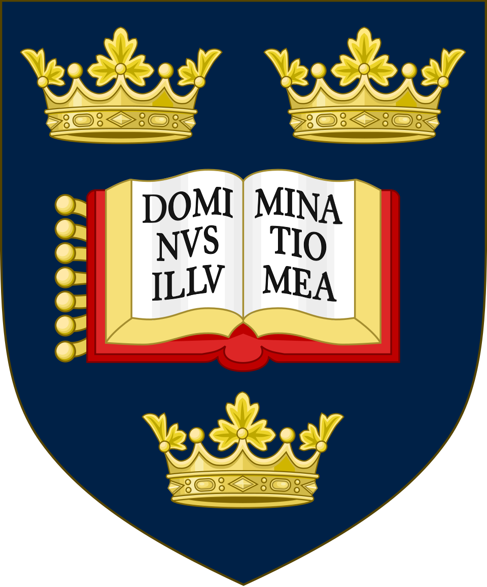
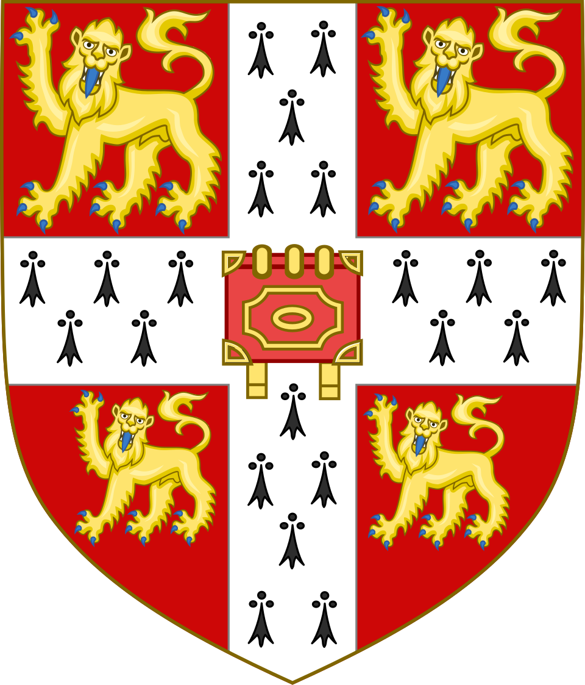

 

   

 

## About

I'm an applied scientist (AI/ML) based in Helsinki, working at the intersection of **artificial intelligence, healthcare, and quantum computing**.

- Member of Technical Staff at **[QuTwo](https://oussamabatouche.com)**, working on next-generation AI for the Quantum era.
- **PhD, University of Helsinki** — computational methods to analyse and improve prostate cancer care using AI, machine learning, statistics, digital pathology, and real-world clinical data.
- Former **Data Scientist at HUCC**, building computational tools for digital pathology and clinical outcome modelling.
- I care about turning messy, real-world medical data into models that clinicians can trust.

 

## Focus Areas

`Artificial Intelligence` &nbsp;·&nbsp; `Machine & Deep Learning` &nbsp;·&nbsp; `Statistics` &nbsp;·&nbsp; `AI for Healthcare` &nbsp;·&nbsp; `Digital Pathology` &nbsp;·&nbsp; `Biostatistics & Survival Analysis` &nbsp;·&nbsp; `Computer Vision` &nbsp;·&nbsp; `Software Engineering`

**Working with**

               

 

## Selected Research

My work centres on computational pathology and clinical outcome modelling for prostate cancer:

- **HistoEncoder** — a digital pathology foundation model for prostate cancer · *arXiv, 2024*
- **Prognostic impact of prostate cancer grade inflation in targeted biopsies** · *European Urology, 2023*
- **Computational pathology-based classifier for predicting Gleason grade group upgrading** · *Journal of Clinical Oncology (ASCO)*
- **A joint frailty model for time-to-treatment and biochemical recurrence in prostate cancer** · *Informatics in Medicine Unlocked, 2025*

Full publication list on my [website](https://oussamabatouche.com) and [ORCID](https://orcid.org/0000-0003-4181-9891).

**In collaboration with**

<table>
  <tr>
    <td align="center" width="170">
        
      <b>University of Helsinki</b>
    </td>
    <td align="center" width="170">
        
      <b>Aalto University</b>
    </td>
    <td align="center" width="170">
        
      <b>Emory University</b>
    </td>
    <td align="center" width="170">
        
      <b>Georgia Tech</b>
    </td>
    <td align="center" width="170">
        
      <b>KAUST</b>
    </td>
  </tr>
</table>
<table>
  <tr>
    <td align="center" width="170">
        
      <b>University of Oxford</b>
    </td>
    <td align="center" width="170">
        
      <b>University of Cambridge</b>
    </td>
    <td align="center" width="170">
        
      <b>Université de Bordeaux</b>
    </td>
    <td align="center" width="170">
        
      <b>Shin-yurigaoka General Hospital</b>
    </td>
  </tr>
</table>

 

## Featured Projects

| Project | Description |
| :-- | :-- |
| **[HistoEncoder](https://github.com/OussamaBatouche/HistoEncoder)** | Foundation model for prostate cancer digital pathology |
| **[Lemonade](https://github.com/lemonade-sdk/lemonade)** | Contributor to AMD's SDK for serving and running local LLMs |
| **[PCC — Cancer AI Assistant](https://github.com/OussamaBatouche/prostate_cancer_ai_assistant)** | AI assistant supporting clinical decision-making |

 

## Get in Touch

- **Website** — [oussamabatouche.com](https://oussamabatouche.com)
- **LinkedIn** — [in/oussama-batouche](https://www.linkedin.com/in/oussama-batouche)
- **ORCID** — [0000-0003-4181-9891](https://orcid.org/0000-0003-4181-9891)

 

